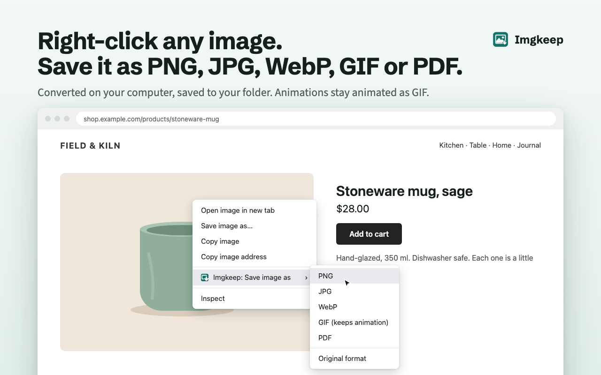

# Imgkeep

Right-click any image and save it as PNG, JPG, WebP or GIF (animation included). Imgkeep converts it on your computer and saves it where you want.



**Install:** [Chrome Web Store](https://chromewebstore.google.com/detail/fkclfgbmjaafglfifenonfcahfdmajbl) · **Website:** [imgkeep.app](https://imgkeep.app) · Free, [MIT licensed](LICENSE)

▶ [Watch the 28-second demo](https://youtu.be/QZfq5xLYdmo)

## Why

Chrome now often saves images as WebP or AVIF, which many apps still can't open. The most popular fix, "Save image as Type" (1M+ users), was sold in late 2025 and removed from the Chrome Web Store as malware in March 2026 after it started injecting affiliate links ([9to5Google](https://9to5google.com/2026/03/16/image-saving-chrome-extension-removed-as-malware/)). Imgkeep does the same everyday job, built so it can't do that.

## Built to be trusted

- Four permissions: `contextMenus`, `downloads`, `storage`, `offscreen`. No access to your pages. See [PERMISSIONS.md](PERMISSIONS.md).
- No analytics, no remote code, no network use except fetching the image you clicked.
- No review prompts, welcome tabs, badges or upsells. A small window opens only when a save needs your decision.
- Plain JavaScript ES modules, no build step, no npm dependencies. One small library is vendored as a single readable file: [gifenc](https://github.com/mattdesl/gifenc) (MIT) in `extension/lib/gifenc.js`, for making GIFs.

Privacy policy: [extension/PRIVACY.md](extension/PRIVACY.md) · Feature ideas and votes: [GitHub Discussions](https://github.com/ybider-tech/imgkeep/discussions/categories/ideas)

If Imgkeep helps you, a [rating on the Chrome Web Store](https://chromewebstore.google.com/detail/fkclfgbmjaafglfifenonfcahfdmajbl/reviews) helps others find it. (The extension itself will never ask.)

## How it works

- **One network request:** the image you right-clicked, fetched in an offscreen document ([`extension/offscreen.js`](extension/offscreen.js)). Nothing else is ever requested.
- **Local conversion:** PNG, JPG and WebP are drawn on a canvas at the image's natural size. For GIF, `ImageDecoder` reads animated WebP, AVIF and APNG frame by frame and gifenc encodes them ([`extension/lib/gif.js`](extension/lib/gif.js)); animated GIFs are saved byte for byte.
- **No host permissions at install:** if a site blocks cross-origin reads, a small window asks whether to allow that one site (`https://that-site/*`). It asks only after you click, and you can remove the site in Options.
- **Enforced by tests:** [`tests/static-check.mjs`](tests/static-check.mjs) fails the build if the permissions change, if `fetch(` appears in any file other than `offscreen.js`, or if any extension file references an outside URL.

## What it does

Right-click an image → **Imgkeep: Save image as** → **PNG**, **JPG**, **WebP**, **GIF (keeps animation)**, or **Original format**.

- Reads WebP, AVIF, SVG, PNG, JPG, GIF and `data:` images.
- **GIF keeps animation:** an animated GIF is saved exactly as it is; animated WebP, AVIF and APNG are converted frame by frame, keeping each frame's timing and transparency. A still image saved as GIF becomes a one-frame GIF. GIFs are made at most 800px wide (larger ones are scaled down, keeping their shape).
- JPG gets your background colour behind transparent areas (default white).
- Quality: JPG 92 and WebP 90 by default, adjustable from 50 to 100.
- File names from a template, default `{name}`. Tokens: `{name}` (file name from the URL, `image` for `data:` URLs), `{host}` (without `www.`), `{date}` (YYYY-MM-DD), `{time}` (HHMMSS), `{w}`, `{h}`. The subfolder setting takes the same tokens, e.g. `Imgkeep/{host}`. Characters that are illegal on Windows or macOS are removed.
- Never overwrites a file.

## Save modes

| Mode | What happens |
|---|---|
| **Downloads folder** (default) | `chrome.downloads` into your downloads folder (plus subfolder). The browser adds " (1)" if the name exists. |
| **A folder you choose** | Pick a folder once in Options. The offscreen document writes the file straight into it, creating subfolders and adding " (2)", " (3)"… instead of overwriting. If the browser needs your OK again, a small window asks you to reconnect and then writes the file. |
| **Ask every time** | The browser's Save As dialog for each image. |

If a site blocks cross-site image reads, **Allow and save** requests access to that one site and retries, and **Save original format instead** downloads the file untouched. You can remove sites in Options → **Sites you've allowed**.

## Load it unpacked

1. Open `chrome://extensions` and turn on **Developer mode**.
2. Click **Load unpacked** and pick the `extension/` folder.
3. Right-click any image. Settings: the extension's **Details → Extension options**, or the Extensions (puzzle) menu → ⋮ → **Options**.

Needs Chrome 116 or newer. A Microsoft Edge Add-ons listing is on the way.

## Known limits

- **Folder reconnect after a restart.** The browser forgets folder access when it restarts unless you chose **Allow on every visit**. Then the first save asks you to reconnect (one click). This can't be done silently: the browser requires a click to grant folder access.
- **Page `blob:` images can't be saved.** Some sites draw images from `blob:` URLs that only exist inside the page. Reading them would need access to your pages, which Imgkeep doesn't have. The error window explains this.
- **Original format and Ask always use Downloads.** In folder mode, **Original format** still saves through the browser's downloads (with your subfolder and name template). **Ask every time** uses the Save As dialog.
- **Original format without a file extension** in the URL is named by the browser from the server's answer, without your subfolder or template.
- Very large images may exceed the browser's canvas limit; you'll see "too large to convert".
- PNG, JPG and WebP output is always a still image: animated images are saved as their first frame. Choose **GIF** to keep the animation.
- GIF output is limited to 600 frames and about 150 million source pixels in total (width × height × frames), and stops after 90 seconds. Bigger animations show a "too large" or "took too long" message.
- GIF has 256 colours per frame and on/off transparency, so photos and soft edges look coarser than in the original. Converting to GIF is a trade-off for compatibility.
- Videos can't be saved as GIF yet.

## Development

Requirements: Node.js 20 or newer. The extension needs nothing; Node is only for tests and store images.

```bash
npm install
npx playwright install chromium
npm test
```

`npm test` generates fixtures if missing, runs the static trust check (`tests/static-check.mjs`), then Playwright:

- `tests/extension.spec.mjs`: the real extension in Chromium against two local servers (one with CORS, one without).
  - Conversions: WebP→PNG, PNG→JPG (white corners), JPG→WebP, AVIF→PNG, SVG→PNG, `data:` input, large files.
  - GIF: animated GIF kept byte for byte; animated WebP keeps frame count, timing and transparency; still image → one-frame GIF; scaled to 800px; over the frame limit → "too large".
  - Saving: Original format, subfolder and name template, never overwriting, folder mode.
  - The ask window (site access, errors, folder), the options page and the context menu.
  - Outputs are decoded and checked for format, size and pixels.
- `tests/settings.spec.mjs`: file-name templating and GIF size limits.
- `tests/site.spec.mjs`: every website page loads with no console errors and no third-party requests, has a unique title, description and canonical, and is in the sitemap. Also checks that `privacy.html` matches `PRIVACY.md` and that there are no trackers.

Other scripts:

| Command | What it does |
|---|---|
| `npm run check` | Static trust check only |
| `npm run icons` | Redraws `extension/icons/*.png`, the site icons and the Edge store logo (Python 3, standard library) |
| `npm run fixtures` | Regenerates test images (AVIF needs macOS `sips`; the file is checked in) |
| `npm run version-css` | After editing `site/style.css`: stamps every page's stylesheet link (`style.css?v=…`) so visitors get the new styles at once. A test fails if you forget. |
| `npm run store` | Renders `store/*.png` from `store/scenes.html`, with real captures of the options page and ask window |
| `npm run video` | Renders the 28-second demo video `store/imgkeep-demo.webm` (1280×720) and its poster from `store/video/demo.html`, using the ffmpeg Playwright installs. `--stills` saves a few frames to check first. |
| `sh scripts/package.sh` | Runs the tests, then builds `dist/imgkeep-<version>.zip` |

### Imgkeep Pro waitlist link

The Options page shows a **Get notified** link under "Imgkeep Pro — coming soon" only when `PRO_WAITLIST_URL` is set in `extension/lib/settings.js`, for example `export const PRO_WAITLIST_URL = "https://imgkeep.app/pro";`. The static check only allows URLs on imgkeep.app and the Chrome Web Store, so host the waitlist page on imgkeep.app (or add its host to `ALLOWED_URL` in `tests/static-check.mjs` on purpose).

## Repository layout

```
extension/   the extension (load unpacked; source of the store zip)
site/        imgkeep.app (GitHub Pages)
tests/       Playwright tests, fixtures, local servers, static check
store/       listing copy, scenes and rendered store images
scripts/     package.sh, make-icons.py, version-css.mjs
docs/        DEPLOYMENT.md: how the site, domain and stores were set up
```

## Releasing a new version

1. Bump `version` in `extension/manifest.json` (and `package.json`), and move the CHANGELOG's notes under the new version.
2. `sh scripts/package.sh` runs every test, then builds `dist/imgkeep-<version>.zip`.
3. Chrome Web Store dashboard → Imgkeep → **Package** → **Upload new package**. Update the **Store listing** from `store/listing.md` if it changed, then **Submit for review**.
4. After approval, update the website if the release changes what Imgkeep does.

First-time setup (GitHub Pages, domain, store accounts) is in [docs/DEPLOYMENT.md](docs/DEPLOYMENT.md).
