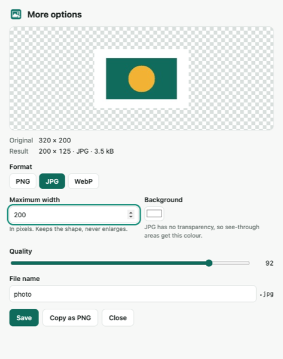
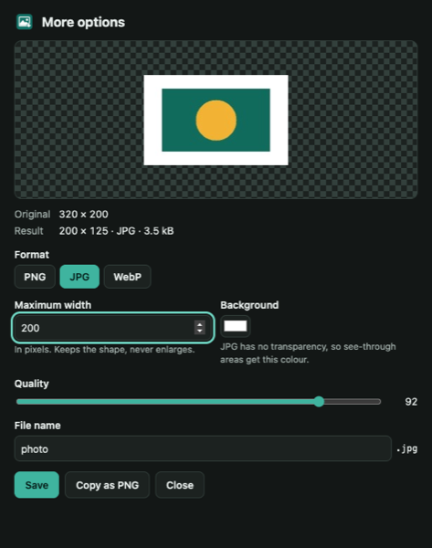
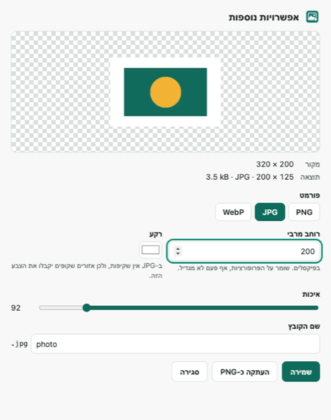
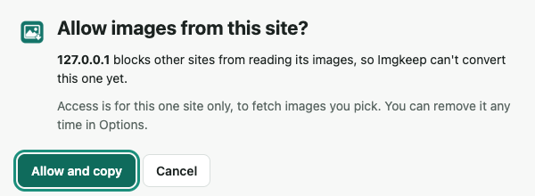
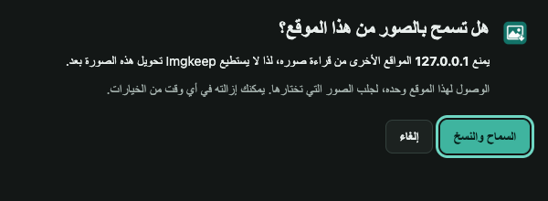

# QA: Imgkeep 0.6.0

Date: 2026-10-04 · Branch `release/0.6.0` · Package `dist/imgkeep-0.6.0.zip`

## Scope

Free in 0.6.0: the shared pipeline with checked output, maximum width, Copy as PNG, More options (live preview),
clearer errors (Try again, Open image), translated into all 9 languages including right-to-left, and the Pro
waitlist link. Presets and file-size targets are held back for Imgkeep Pro. The size-target code is in the
pipeline and covered by tests, but not shown in the UI.

## Automated results

| Where | Result |
|---|---|
| macOS, Playwright Chromium (`npm test`) | 72 passed, 2 skipped (the Hebrew/Japanese tests skip on macOS, which ignores the test's language) |
| Static trust check | Passed: same 4 permissions, no host access, `fetch` only in `offscreen.js`, no outside URLs, all 9 locales complete |
| Linux and Windows (GitHub Actions) | Both passed ([run 37213823770](https://github.com/ybider-tech/imgkeep/actions/runs/37213823770)). The Hebrew and Japanese tests really ran in Hebrew and Japanese on both. The first Windows run caught a site-test problem with Windows line endings, now fixed. |

## Acceptance criteria

| # | Criterion | Status | Evidence |
|---|---|---|---|
| 1 | Static WebP exported as JPG opens as JPEG; MIME, signature and `.jpg` agree | ✅ | `tools.spec` "Checked output". Every save also checks the output's bytes in `lib/image.js` `verifyOutput` |
| 2 | 2400 × 1200 with max width 1600 → 1600 × 800; smaller source unchanged | ✅ | `tools.spec` "Maximum width", `settings.spec` "Resize" |
| 3 | 200 KB export ≤ 200,000 bytes; an impossible target doesn't download | ✅ in the pipeline (UI is Pro) | `tools.spec` "Size cap", `settings.spec` "Size cap". The "open the editor with the achieved size" part ships with Pro |
| 4 | Transparency kept in PNG/WebP; JPG gets the chosen background | ✅ | `tools.spec` "Transparency" (settings and More options) |
| 5 | Copy as PNG pastes without a download; denied clipboard shows a fallback | ✅ | `tools.spec` "Copy as PNG…" ×3: clipboard read back as `image/png`, no download, clipboard left unchanged on refusal, PNG saved instead. A manual check also confirmed a real PNG on the macOS clipboard (`clipboard info` → `PNGf`) |
| 6 | Presets survive restarts, edits, reordering | ⏸ Pro | — |
| 7 | Animated GIF saved as original stays animated | ✅ (unchanged) | `extension.spec` "GIF: an animated GIF is saved byte for byte"; Original format is byte for byte |
| 8 | Missing, denied, expired and corrupt sources give clear errors and no empty files | ✅ | `tools.spec` "Errors…" (404, corrupt, empty), "A window whose job is gone", "Copy… from a site that blocks it", "More options: a broken image"; `extension.spec` host and HTTP tests |
| 9 | Concurrent saves keep their own source, name and settings; resources released | ✅ | `tools.spec` "Concurrent saves" (4 at once, different formats and widths); the offscreen document holds 0 files and 0 sources afterwards |
| 10 | Existing actions and settings still work | ✅ on macOS | All 0.5.0 tests pass unchanged, except the Options waitlist test, which now expects the link |

## Real images from the web

Quick saves with maximum width 400 and file names `{name}-{w}x{h}`. Every file's type was read from its bytes.

| Source | PNG | JPG | WebP | GIF | PDF |
|---|---|---|---|---|---|
| JPG on Wikimedia's CDN (172 × 178) | ✅ PNG 31 kB | ✅ JPEG 6.9 kB | ✅ WebP 4.6 kB | ✅ GIF 7.1 kB | ✅ PDF 7.6 kB |
| Animated WebP (mathiasbynens.be), scaled to 400 × 400 | ✅ first frame | ✅ first frame | ✅ first frame | ✅ animated GIF 116 kB | ✅ first frame |
| AVIF on GitHub raw, scaled to 400 × 266 | ✅ 255 kB | ✅ 38 kB | ✅ 30 kB | ✅ 77 kB | ✅ 39 kB |
| SVG on Wikimedia (150 × 150) | ✅ | ✅ | ✅ | ✅ | ✅ |
| WebP on gstatic.com (no CORS headers) | asks "Allow images from this site?" | same | same | same | same |

After all 30 saves, the offscreen document held nothing (`pending: 0, sources: 0`).

## Screenshots

More options (light, dark, Hebrew right to left), and Copy as PNG on a site that blocks reads (English, Arabic dark):

 

 

Bug found and fixed during visual QA: in right-to-left languages the result line ("1,600 × 800 · JPG · 183 kB") came out
scrambled. Each part is now isolated (`<bdi dir="ltr">`), and the language test checks for it.

## Image sources that remain unsupported

- `blob:` images that only exist inside a page (needs page access; decided to skip).
- CSS background images and `<canvas>` drawings: the browser's right-click menu doesn't offer them as images.
- Formats Chrome can't decode: HEIC, TIFF.
- Hotlink-protected images that only answer requests from their own pages (Imgkeep can't send their page's Referer).
  **Original format** or **Open image** is the way out.
- In More options, GIF and PDF aren't offered (they stay in the right-click menu).

## Not covered automatically. Please check by hand before submitting

1. **Branded Chrome on Windows and macOS.** The tests use Playwright's Chromium. Branded Chrome no longer loads
   unpacked extensions from the command line, so load `extension/` with Developer mode and try: right-click → Copy
   as PNG, then paste into an app (Slack, Docs, Word, Paint); More options → JPG, width 800 → Save.
2. **Microsoft Edge:** the same two checks.
3. **Focus:** start a Copy as PNG and click into another window straight away. It should say it couldn't copy and offer
   Try again, which works.
4. **Chrome 116** is the declared minimum but isn't tested automatically.
